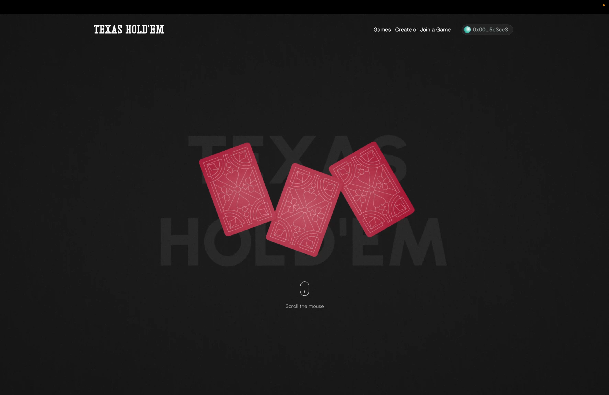
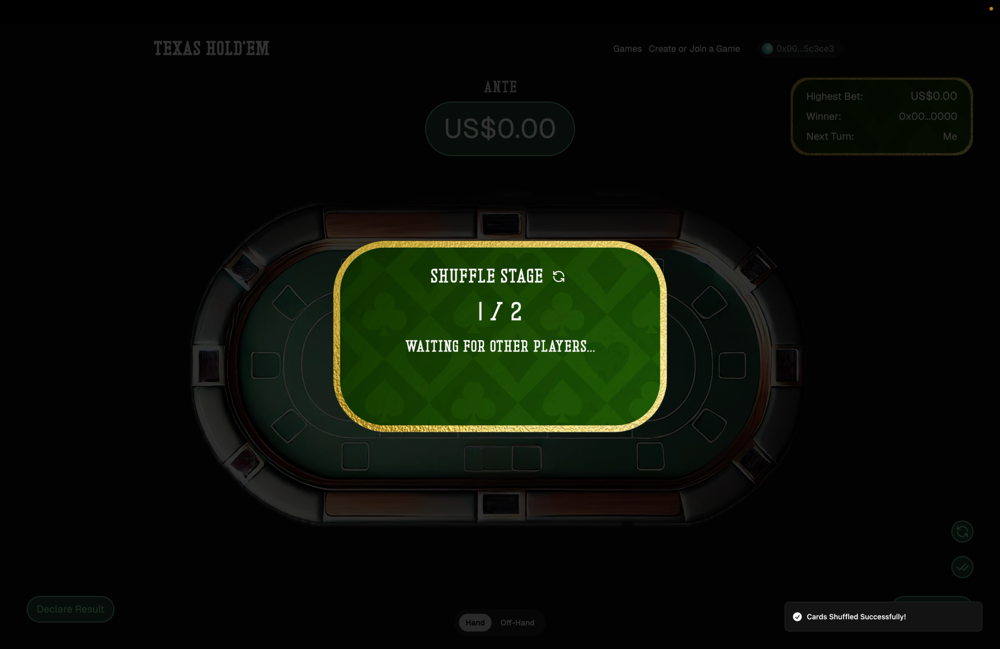
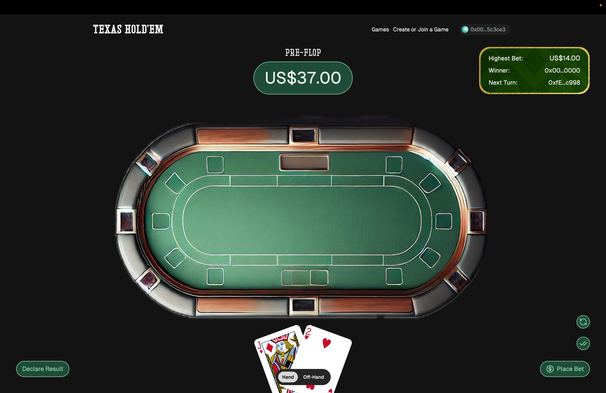
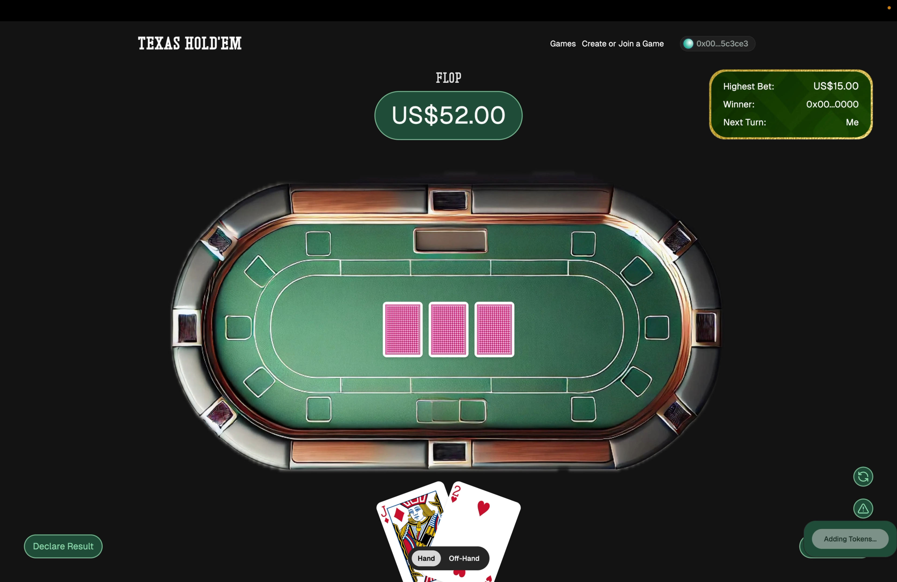
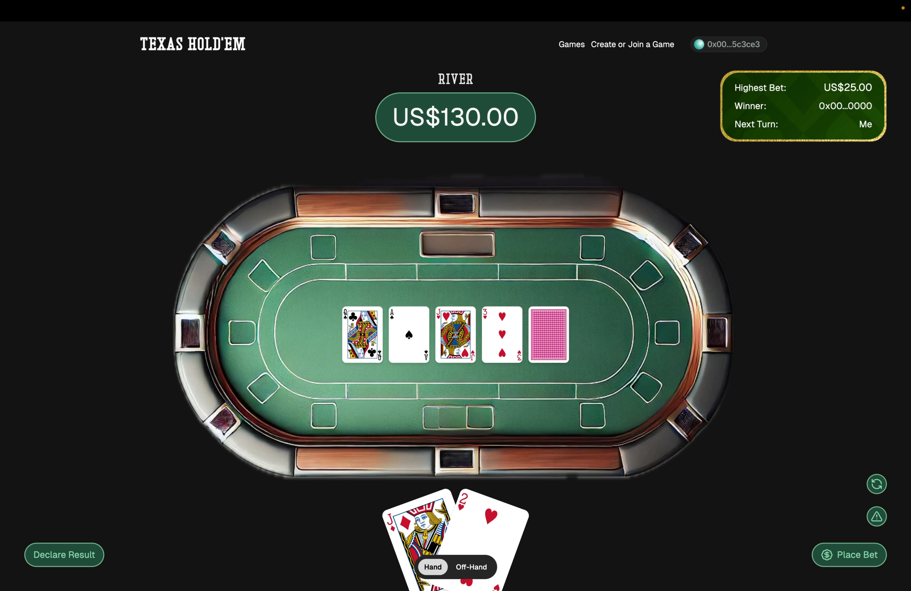
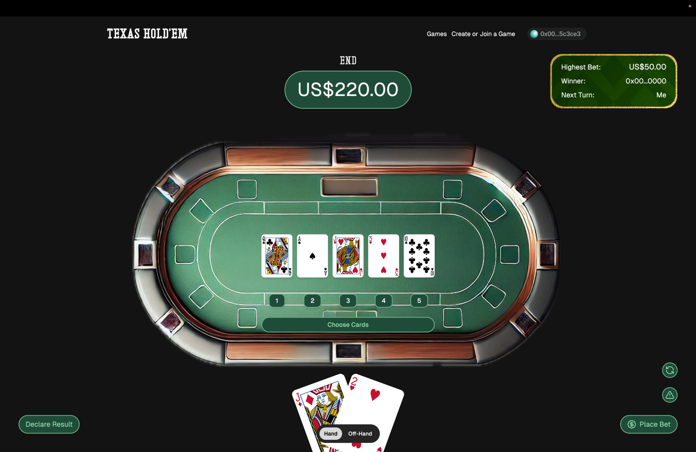
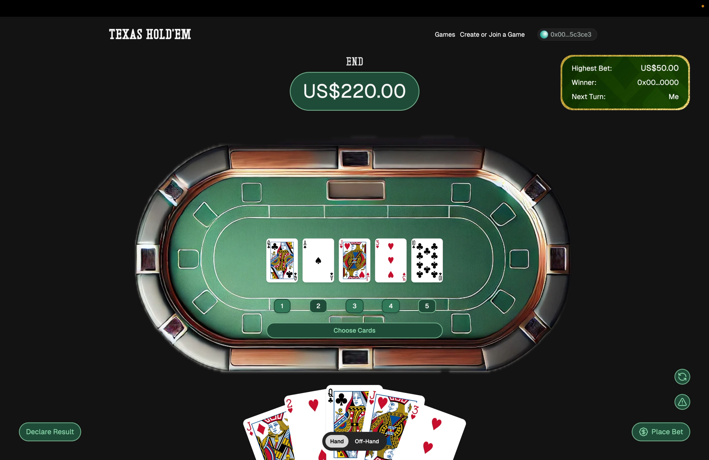
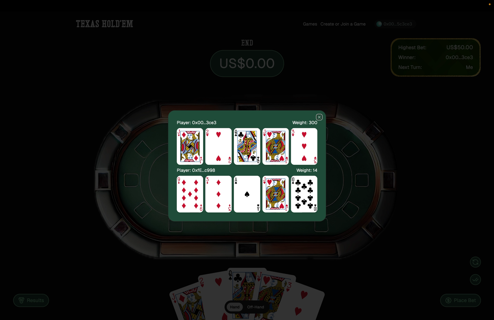

<p align="center">
</p>

Texas Hold'em is a on-chain implementation of a popular poker game, Texas Hold'em. The game is built using Zypher Network's ZK Shuffle SDK, where each player take turns to shuffle the deck and deal the cards. The game is deployed on opBNB Testnet.

- Game Factory Address: [0x66dab6ec6bb97d5adf6fabfe16193f2a28d1ed09](https://opbnb-testnet.bscscan.com/address/0x66dab6ec6bb97d5adf6fabfe16193f2a28d1ed09)
- Texas Poker Library: [0xd24176eCCC9AB8e9f3c40715882Fc8eF784d5C02](https://opbnb-testnet.bscscan.com/address/0xd24176eCCC9AB8e9f3c40715882Fc8eF784d5C02)
- QuickSort Library: [0xc65D06e75b1637D4151D3FCa15AC0079a4101834](https://opbnb-testnet.bscscan.com/address/0xc65D06e75b1637D4151D3FCa15AC0079a4101834)

## How it works 🛠️

After a game is created multiple players can join the game. After a minimum of 2 players have joined the game, the game can be started by anyone. The game Involves 3 stages:

- **Shuffle Stage**
- **Betting Stage**
- **Reveal Stage**

---

### Shuffle Stage

The first stage in the game is the Shuffle Stage where the players can shuffle the cards. The Shuffling occurs as follows:

1. `Player 1`: The first player generates a masked deck and then shuffles the deck and sends it on chain along with the Public Key Commitment and the SNARK Proof.
2. `Player 2`-`Player N`: Remaining players fetch the on-chain deck and shuffle the cards and send it on chain along with the SNARK Proof.

---

### Betting Stage

The betting stage is divided into 5 Rounds where in each stage players have to place bets.

1. `Ante`: In this round players have to contribute to the pot. This is a pre-bid round.
2. `Pre-Flop`: In this round, 2 cards are dealt to each player and the player has to place a bet. Also Players need to submit reveal tokens for other player cards so that other players can unmask their cards, also ensuring that only the owner can unmask the card.
3. `Flop`: In this round, 3 community cards are revealed to the players and the players have to place bets to complete this round. Also Players need to submit reveal tokens these cards.
4. `Turn`: In this round, the 4th community card is revealed to the players and the players have to place bets to complete this round. Also Players need to submit reveal tokens these cards.
5. `River`: In this round, the 5th community card is revealed to the players and the players have to place bets to complete this round. Also Players need to submit reveal tokens these cards.

After all rounds have been completed we can move on to the next stage.

---

### Reveal Stage

At this point all bets have been submitted so players need to reveal their 2 initial cards, so each player submits their own reveal tokens so that others can see those cards.

Also each player can choose 3 cards from the 5 community cards to make a powerful hand. The player with the most powerful hand wins the game.

The logic to calculate the most powerful hand can be found [here](./packages/contracts/src/libraries/TexasPoker.sol)

## Demo Video 🎥

[](https://www.youtube.com/watch?v=1lw5bxYwsPk)

## Screenshots 📸

<table>
  <tr>
    <td valign="top" width="50%">
      <br>
      
    </td>
    <td valign="top" width="50%">
      <br>
      
    </td>
  </tr>
</table>

<table>
  <tr>
    <td valign="top" width="50%">
      <br>
            
    </td>
    <td valign="top" width="50%">
      <br>
            
    </td>
  </tr>
</table>

<table>
  <tr>
    <td valign="top" width="50%">
      <br>
            
    </td>
    <td valign="top" width="50%">
      <br>
            
    </td>
  </tr>
</table>

<table>
  <tr>
    <td valign="top" width="50%">
      <br>
            
    </td>
    <td valign="top" width="50%">
      <br>
            
    </td>
  </tr>
</table>

## 🧑🏼‍💻 Tech Stack

- **Frontend**: Next.js, Tailwind CSS, `@shadcn/ui`
- **Integration**: `wagmi`, `web3modal`, `@zypher-game/secret-engine`
- **Smart Contracts**: `Solidity`, `Foundry`
- **Backend**: `Hono`

## Get Started 🚀

The following repository is a turborepo and divided into the following:

- **apps/www** - The web application built using NextJS.

First install the dependencies by running the following:

```

pnpm install

```

Then fill in the Environment variables in `apps/www/.env.local`

```bash
NEXT_PUBLIC_WALLETCONNECT_ID="YOUR_WALLETCONNECT_ID"
```

Then run the following command to start the application:

```bash
pnpm dev
```

---
